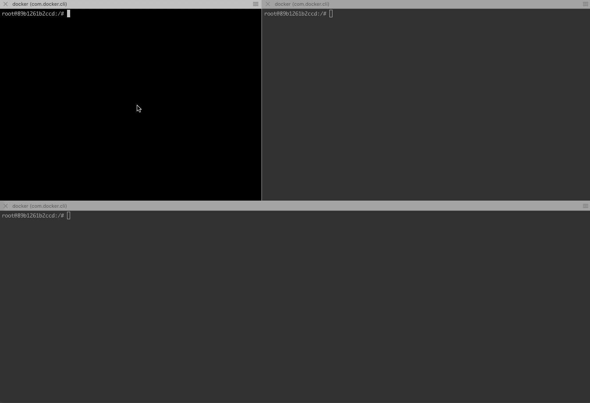

# multi-process
基于swoole实现的多进程管理器，类似于supervisor.

# 为什么要写multi-process
## php环境不用搭建其他多进程管理器
能够基于php的环境实现多进程管理，而不另外搭建其他多进程管理服务

## php长进程存在的风险
基于php实现的长进程脚本，大部分业务是基于I/O的消息阻塞。

程序运行时存在一些隐患
- 程序不当或者扩展带来的内存泄漏，长时间运行会导致内存溢出
- php程序依赖的服务代码有更新，业务功能不能及时更新：程序做到自重启是一个有效的方法。 

# 引入使用
```
# git clone git@github.com:xingwenge/multi-process.git
# cd multi-process
# composer update
# cd bin
# php ./multiprocessd -c demo.yaml
# php ./demo/redis-queue-push.php
# php ./multiprocessctl -c demo.yaml -s stop
```

or

```
# composer require xingwenge/multi-process
# mkdir multi-process && cd multi-process
# cp -r ../vendor/xingwenge/multi-process/bin/* .
# php ./multiprocessd -c demo.yaml
# php ./demo/redis-queue-push.php
# php ./multiprocessctl -c demo.yaml -s stop
``` 


# 依赖
- swoole

# 示例程序
配置文件
```./bin/demo.yaml```

```php
settings:
  workDir: /tmp/multi-process          # 工作目录，存放进程id、日志

programs:                               
  Demo:                                 # 进程名称
    bin: /usr/local/php/bin/php         # 进程运行路径
    binArgs:                            # 参数
      - /data/www/multiprocess/bin/demo/redis-queue-pop.php
    startSecs: 3                        # 进程运行最小时长
    startRetries: 3                     # 程序运行失败重试的最大次数

```

启动
```./bin/multiprocessd -c ./bin/demo.yaml```

平滑结束
```./bin/multiprocessctl -c ./bin/demo.yaml -s quit```

停止
```./bin/multiprocessctl -c ./bin/demo.yaml -s stop```

推送redis队列消息
```php ./bin/demo/redis-queue-push.php```

通过进程管理器创建的进程，阻塞拉取redis队列，并显示消息


